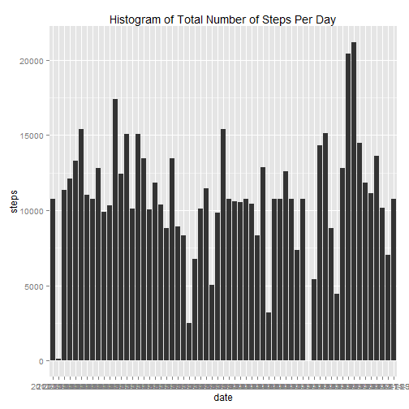

R Reproducible Data Peer Assessment 1
========================================================

## Loading and preprocessing the data

Load the data via read.csv()

```r
activity <- read.csv("activity.csv")
attach(activity)
summary(activity)
```

```
##      steps               date          interval   
##  Min.   :  0.0   2012-10-01:  288   Min.   :   0  
##  1st Qu.:  0.0   2012-10-02:  288   1st Qu.: 589  
##  Median :  0.0   2012-10-03:  288   Median :1178  
##  Mean   : 37.4   2012-10-04:  288   Mean   :1178  
##  3rd Qu.: 12.0   2012-10-05:  288   3rd Qu.:1766  
##  Max.   :806.0   2012-10-06:  288   Max.   :2355  
##  NA's   :2304    (Other)   :15840
```

Process/transform the data (if necessary) into a format suitable for your analysis

```r
activity$date <- strptime(activity$date, format="%Y-%m-%d")
```

## What is mean total number of steps taken per day? (Ignore missing values)

Calculate the total number of steps taken per day

```r
totalsteps <- aggregate(activity$steps, list(date), sum, na.rm=TRUE)
colnames(totalsteps) <- c("date","steps")
head(totalsteps,10)
```

```
##          date steps
## 1  2012-10-01     0
## 2  2012-10-02   126
## 3  2012-10-03 11352
## 4  2012-10-04 12116
## 5  2012-10-05 13294
## 6  2012-10-06 15420
## 7  2012-10-07 11015
## 8  2012-10-08     0
## 9  2012-10-09 12811
## 10 2012-10-10  9900
```

Make a histogram of the total number of steps taken each day

```r
library(ggplot2)
```

```
## Warning: package 'ggplot2' was built under R version 3.1.2
```

```r
ggplot(totalsteps) + aes(x=date, y=steps) +
  geom_histogram(stat="identity") + 
  labs(title="Histogram of Total Number of Steps Per Day")
```

 

Calculate and report the mean and median of the total number of steps taken per day

```r
mean(totalsteps$steps, na.rm=TRUE)
```

```
## [1] 9354
```

```r
median(totalsteps$steps, na.rm=TRUE)
```

```
## [1] 10395
```

## What is the average daily activity pattern?

Make a time series plot (i.e. type = "l") of the 5-minute interval (x-axis) and the average number of steps taken, averaged across all days (y-axis)

```r
timeseries <- aggregate(steps ~ interval, data = activity, mean)
plot(timeseries, 
     type = "l", 
     main="Ave. no. of steps taken for each 5 minute interval",
     xlab="Time interval")
```

 

Which 5-minute interval, on average across all the days in the dataset, contains the maximum number of steps?

```r
timeseries[timeseries$steps == max(timeseries$steps), 1]
```

```
## [1] 835
```

## Imputing missing values

Note that there are a number of days/intervals where there are missing values (coded as NA). The presence of missing days may introduce bias into some calculations or summaries of the data.

Calculate and report the total number of missing values in the dataset (i.e. the total number of rows with NAs)

```r
sum(is.na(activity))
```

```
## [1] 2304
```
Devise a strategy for filling in all of the missing values in the dataset. The strategy does not need to be sophisticated. For example, you could use the mean/median for that day, or the mean for that 5-minute interval, etc.

Create a new dataset that is equal to the original dataset but with the missing data filled in.

```r
activity2 <- activity
# loop through each row in activity
for (i in 1:nrow(activity)) 
{
    if(is.na(activity$steps[i])) 
    {
        activity2$steps[i] <- timeseries$steps[which(timeseries$interval==activity$interval[i])]
    }
}
```
Make a histogram of the total number of steps taken each day

```r
totalsteps2 <- aggregate(activity2$steps, list(date), sum, na.rm=TRUE)
colnames(totalsteps2) <- c("date","steps")
ggplot(totalsteps2) + aes(x=date, y=steps) +
  geom_histogram(stat="identity") + 
  labs(title="Histogram of Total Number of Steps Per Day")
```

 
Calculate and report the mean and median total number of steps taken per day. Do these values differ from the estimates from the first part of the assignment? What is the impact of imputing missing data on the estimates of the total daily number of steps?

```r
mean(totalsteps2$steps, na.rm=TRUE)
```

```
## [1] 10766
```

```r
median(totalsteps2$steps, na.rm=TRUE)
```

```
## [1] 10766
```
Since the NAs were treated as 0s before, the mean and median steps increased as we inputed a positive non-zero number.

Are there differences in activity patterns between weekdays and weekends? For this part the weekdays() function may be of some help here. Use the dataset with the filled-in missing values for this part.

Create a new factor variable in the dataset with two levels - "weekday" and "weekend" indicating whether a given date is a weekday or weekend day.


```r
library(lubridate)
```

```
## Warning: package 'lubridate' was built under R version 3.1.2
```

```r
activity2$daytype <- as.factor(ifelse(wday(activity2$date, label=TRUE) %in% c("Sat", "Sun"), "weekend", "weekday"))
```

Make a panel plot containing a time series plot (i.e. type = "l") of the 5-minute interval (x-axis) and the average number of steps taken, averaged across all weekday days or weekend days (y-axis). See the README file in the GitHub repository to see an example of what this plot should look like using simulated data.

```r
par(mfrow = c(2, 1))
for (type in c("weekend", "weekday")) {
    weekend <- aggregate(steps ~ interval, data = activity2, subset = activity2$daytype == type, FUN = mean)
    plot(weekend, type = "l", main = type)
}
```

 
